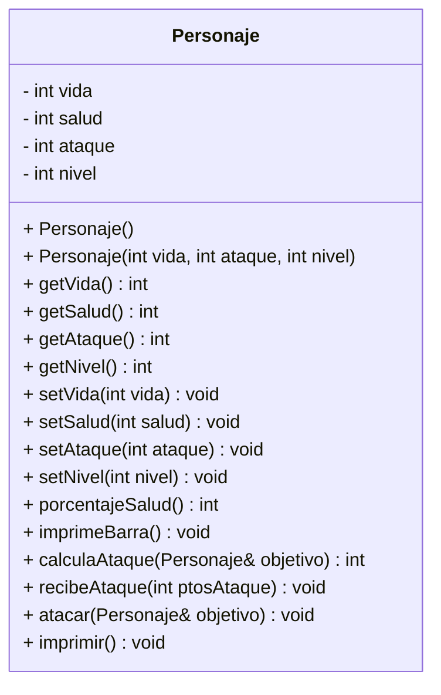

# Proyecto A01666950

## Clase Personaje

Este proyecto implementa una clase **Personaje** que representa una unidad de combate. La clase cuenta con atributos para la vida, salud, ataque y nivel, además de métodos para calcular ataques, recibir daño y mostrar el estado del personaje.

## Diagrama UML

Personaje <|-- Guerrero
Personaje <|-- Arquero
Personaje <|-- Mago
```

## Descripción de las clases

### Personaje
Es la clase base del proyecto. Contiene los atributos generales de una unidad de combate (vida, salud, ataque y nivel) y los métodos para atacar, recibir daño, calcular el ataque e imprimir la información del personaje.

### Guerrero
El Guerrero posee el atributo **fuerza**, que incrementa el daño de sus ataques y le permite reducir parte del daño recibido por los enemigos, convirtiéndolo en una unidad resistente.

### Arquero
El Arquero posee el atributo **precisión**, que representa la probabilidad de realizar un ataque crítico. Cuando ocurre un ataque crítico, el daño infligido al enemigo aumenta.

### Mago
El Mago posee el atributo **maná**, el cual utiliza para potenciar sus ataques. Cada vez que utiliza un hechizo consume maná y, mientras conserva suficiente maná, también reduce el daño recibido por los ataques enemigos.

