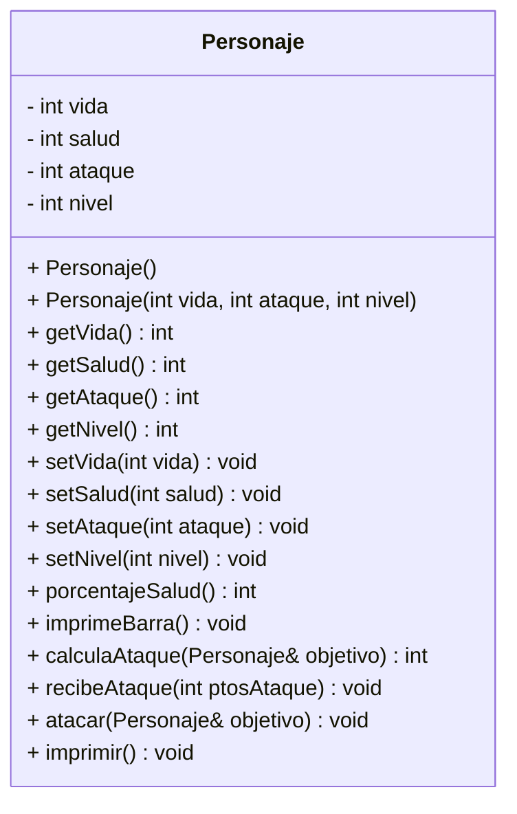

# Proyecto A01666950

## Clase Personaje

Este proyecto implementa una clase **Personaje** que representa una unidad de combate. La clase cuenta con atributos para la vida, salud, ataque y nivel, además de métodos para calcular ataques, recibir daño y mostrar el estado del personaje.

## Diagrama UML

