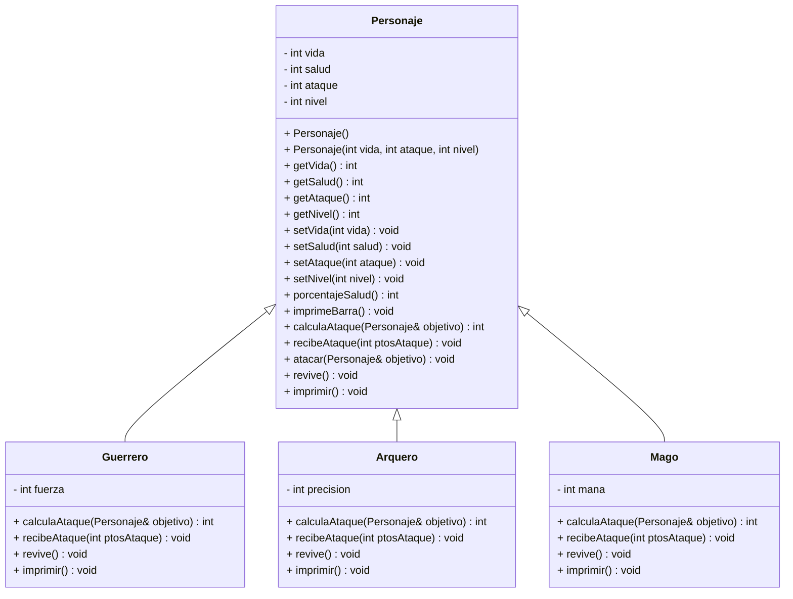

# Evidencia 2 | Proyecto integrador

Alumno: Valeria Alexandra Cruz Velásquez
Matrícula: A01666950
Profesor: León Felipe Guevara Chávez


## Introducción

El proyecto consiste en realizar una simulación de batalla entre dos ejércitos utilizando C++. Cada ejército está formado por diferentes tipos de combatientes: `Guerrero`, `Arquero` y `Mago`.

Para realizar el proyecto se utilizó programación orientada a objetos. Se creó una clase base llamada `Personaje`, de la cual heredan las tres clases de combatientes. Cada tipo de personaje tiene características especiales que afectan su manera de atacar, recibir daño y revivir.

Los datos de los combatientes se cargan desde dos archivos de texto, uno para cada ejército. Después de cargar los personajes, el programa muestra a los integrantes de ambos ejércitos y comienza la batalla. Los personajes se enfrentan por turnos hasta que uno de los ejércitos se queda sin combatientes.

Al finalizar, el programa muestra cuál fue el ejército ganador y cuáles fueron los personajes que sobrevivieron.


## Diagrama UML


```mermaid
classDiagram

class Personaje{
    - int vida
    - int salud
    - int ataque
    - int nivel

    + Personaje()
    + Personaje(int vida, int ataque, int nivel)
    + getVida() int
    + getSalud() int
    + getAtaque() int
    + getNivel() int
    + setVida(int vida) void
    + setSalud(int salud) void
    + setAtaque(int ataque) void
    + setNivel(int nivel) void
    + porcentajeSalud() int
    + imprimeBarra() void
    + calculaAtaque(Personaje& objetivo) int
    + recibeAtaque(int ptosAtaque) void
    + atacar(Personaje& objetivo) void
    + revive() void
    + imprimir() void
}

class Guerrero{
    - int fuerza
    + calculaAtaque(Personaje& objetivo) int
    + recibeAtaque(int ptosAtaque) void
    + revive() void
    + imprimir() void
}

class Arquero{
    - int precision
    + calculaAtaque(Personaje& objetivo) int
    + recibeAtaque(int ptosAtaque) void
    + revive() void
    + imprimir() void
}

class Mago{
    - int mana
    + calculaAtaque(Personaje& objetivo) int
    + recibeAtaque(int ptosAtaque) void
    + revive() void
    + imprimir() void
}

Personaje <|-- Guerrero
Personaje <|-- Arquero
Personaje <|-- Mago
```

### Herencia

La herencia se utiliza entre la clase `Personaje` y las clases `Guerrero`, `Arquero` y `Mago`.

Los tres tipos de personajes comparten características como vida, salud, ataque y nivel, por lo que estas se encuentran en la clase `Personaje`. Cada clase derivada agrega además su propio atributo especial:

* `Guerrero`: fuerza.
* `Arquero`: precisión.
* `Mago`: maná.

Esto permite reutilizar código y evitar repetir los mismos atributos y métodos en todas las clases.

### Polimorfismo

El polimorfismo se utiliza principalmente en los vectores que representan a los ejércitos:

```cpp
vector<Personaje*> ejercito1;
vector<Personaje*> ejercito2;
```

Estos vectores pueden almacenar apuntadores a objetos de tipo `Guerrero`, `Arquero` y `Mago`.

Gracias a los métodos virtuales, cuando se llama a funciones como `calculaAtaque()`, `recibeAtaque()`, `revive()` o `imprimir()`, se ejecuta la versión correspondiente al tipo real de personaje.

Esto permite que todos los combatientes puedan manejarse desde una misma estructura, pero manteniendo sus comportamientos especiales.

### Clase abstracta

`Personaje` es una clase abstracta porque contiene el método virtual puro:

```cpp
virtual void revive() = 0;
```

Esto significa que no se pueden crear objetos directamente de tipo `Personaje`.

Cada clase derivada tiene que implementar su propia forma de revivir. El Guerrero utiliza su fuerza, el Arquero su precisión y el Mago su maná.

### Sobreescritura de métodos

Las clases derivadas sobrescriben métodos de la clase `Personaje` utilizando `override`.

Algunos ejemplos son:

```cpp
int calculaAtaque(Personaje& objetivo) override;
void recibeAtaque(int ptosAtaque) override;
void revive() override;
void imprimir() override;
```

Esto permite que cada tipo de combatiente tenga un comportamiento diferente durante la batalla.

### Sobrecarga de operadores

Se sobrecargó el operador `<<` para poder mostrar la información de los personajes utilizando `cout`:

```cpp
cout << *ejercito[i];
```

La sobrecarga utiliza el método virtual `imprimir()`, por lo que se mantiene el polimorfismo y cada personaje puede mostrar su información correspondiente.

### Excepciones

Se creó una excepción personalizada llamada `ErrorArchivo`, que hereda de `runtime_error`.

Esta excepción se utiliza para controlar errores relacionados con la lectura de los archivos de los ejércitos. Por ejemplo, si un archivo no puede abrirse o si contiene un tipo de personaje que el programa no reconoce.

En `main()` se utiliza un bloque `try-catch` para capturar la excepción personalizada y también las excepciones estándar:

```cpp
try {
    cargarEjercito(ejercito1, "ejercito1.txt");
    cargarEjercito(ejercito2, "ejercito2.txt");
}
catch (const ErrorArchivo& e) {
    cerr << "ERROR: " << e.what() << endl;
}
catch (const exception& e) {
    cerr << "ERROR INESPERADO: " << e.what() << endl;
}
```

De esta manera, el programa puede informar al usuario cuando ocurre un problema en lugar de terminar inesperadamente.

---

## Funcionamiento del programa

El programa principal se encuentra en `exercise.cpp`.

Primero se crean dos vectores de apuntadores a `Personaje`, uno para cada ejército. Después, mediante la función `cargarEjercito()`, se leen los datos de `ejercito1.txt` y `ejercito2.txt`, y se crean dinámicamente los objetos correspondientes.

Después se muestran los integrantes de cada ejército utilizando la función `mostrarEjercito()`.

La batalla se realiza en la función `batalla()`. Los personajes se enfrentan uno contra uno y atacan por turnos. Durante el combate se muestra el daño realizado, la salud restante y el estado de los combatientes.

Los personajes también pueden utilizar sus habilidades especiales. Dependiendo de sus recursos, un Guerrero puede utilizar su fuerza, un Arquero su precisión y un Mago su maná para revivir.

La batalla termina cuando uno de los ejércitos se queda sin combatientes. Finalmente, se muestra el ejército ganador y los personajes sobrevivientes.

---

## Conclusión personal

Este proyecto me ayudó a reforzar los conceptos que vimos durante el curso y a entender cómo se pueden utilizar juntos en un programa más completo.

Principalmente aprendí a utilizar mejor la herencia y el polimorfismo, ya que pude crear diferentes tipos de personajes a partir de una clase base y hacer que cada uno tuviera comportamientos diferentes.

También reforcé el uso de clases abstractas, métodos virtuales, sobreescritura y sobrecarga de operadores. Además, aprendí a utilizar excepciones para manejar posibles errores al leer los archivos.

En general, realizar la simulación de batalla me ayudó a comprender mejor cómo interactúan diferentes clases y objetos dentro de un mismo programa y cómo los conceptos de programación orientada a objetos pueden utilizarse para resolver una situación concreta.


## Referencias

* GeeksforGeeks. (2026, 3 julio). Exception Handling in C++. GeeksforGeeks. https://www.geeksforgeeks.org/cpp/exception-handling-c/ 
* Martínez Treviño, Y.  (6 abril 2021). 4a. Sobrecarga de Operadores en C++Links to an external site.. [Video Youtube].
* Martínez Treviño, Y. (6 abril 2021). 4c. Sobrecarga de los operadores de Input y Output en C++.Links to an external site. [Video Youtube].
* GeeksforGeeks. (2026a, enero 17). Operator Overloading in C++. GeeksforGeeks. https://www.geeksforgeeks.org/cpp/operator-overloading-cpp/ 
* Martínez Treviño, Y. (23 mayo 2021). 3c Polimorfismo en C++.Links to an external site. [Video Youtube].
* Martínez Treviño, Y. (5 abril 2021). 3d. Clases Abstractas en C++Links to an external site.. [Video Youtube].
* GeeksforGeeks. (2026b, mayo 27). Polymorphism in C++. GeeksforGeeks. https://www.geeksforgeeks.org/cpp/cpp-polymorphism/

